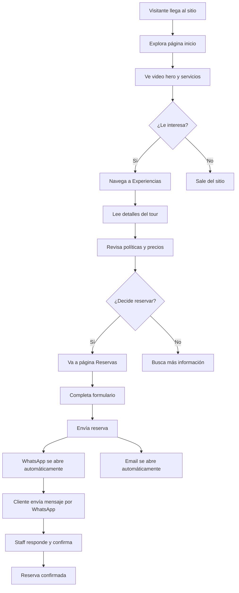
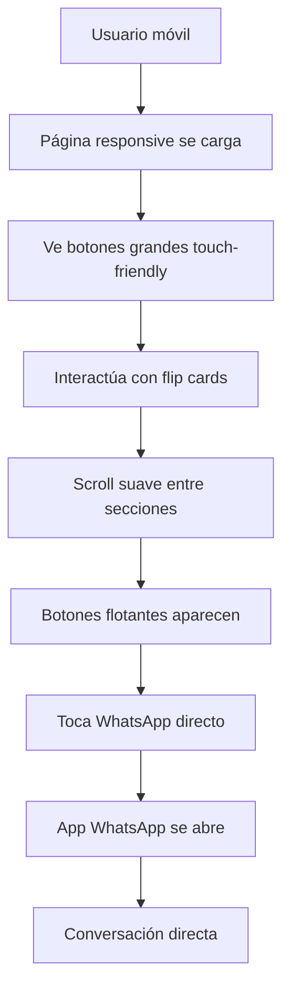
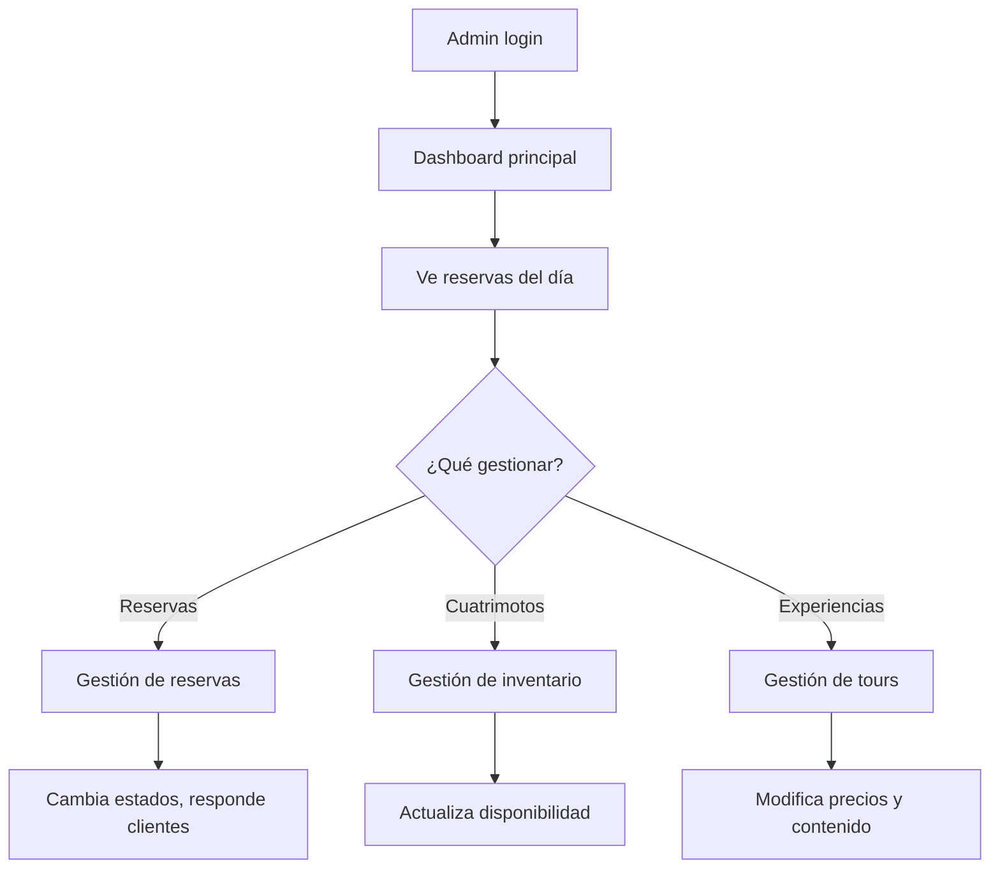

# 👥 HISTORIAS DE USUARIO - CHOCÓ AVENTURAS

**Fecha:** 21 de Octubre de 2025
**Proyecto:** Chocó Aventuras - Plataforma de Turismo de Aventura
**Versión:** 1.0

---

## 🎯 IDENTIFICACIÓN DE USUARIOS

### **1. USUARIOS PRIMARIOS**

#### 🧑‍🤝‍🧑 **VISITANTES/TURISTAS**
- **Perfil**: Personas interesadas en turismo de aventura en el Chocó
- **Demografía**: 18-45 años, clase media-alta, aventureros
- **Motivaciones**: Adrenalina, conexión con naturaleza, experiencias únicas
- **Dispositivos**: Principalmente móvil (70%), desktop (30%)

#### 👨‍💼 **ADMINISTRADORES CHOCÓ AVENTURAS**
- **Perfil**: Staff de la empresa, guías, recepcionistas
- **Responsabilidades**: Gestión de reservas, cuatrimotos, clientes
- **Necesidades**: Herramientas de administración, reportes, comunicación
- **Dispositivos**: Desktop (60%), móvil (40%)

### **2. USUARIOS SECUNDARIOS**

#### 🏢 **CLIENTES CORPORATIVOS**
- **Perfil**: Empresas buscando team building, eventos corporativos
- **Necesidades**: Reservas grupales, facturación empresarial, planificación
- **Volumen**: Reservas de 5-20 personas

#### 👨‍👩‍👧‍👦 **FAMILIAS**
- **Perfil**: Padres con hijos adolescentes (16+ años)
- **Necesidades**: Actividades seguras, información detallada, precios familiares
- **Consideraciones**: Seguridad prioritaria, supervisión

#### 🎥 **INFLUENCERS/CREADORES DE CONTENIDO**
- **Perfil**: Content creators, travel bloggers, youtubers
- **Necesidades**: Experiencias fotogénicas, colaboraciones, promociones
- **Valor**: Marketing orgánico para la empresa

---

## 📱 HISTORIAS DE USUARIO POR FLUJO

### **🌟 FLUJO 1: DESCUBRIMIENTO Y EXPLORACIÓN**

#### **HU-001: Conocer Chocó Aventuras**
> **Como** visitante interesado en turismo de aventura
> **Quiero** conocer qué servicios ofrece Chocó Aventuras
> **Para** decidir si es la experiencia que busco

**Criterios de Aceptación:**
- ✅ Veo información clara sobre cuatrimotos y paintball
- ✅ Puedo acceder desde cualquier dispositivo
- ✅ La página carga rápido (< 3 segundos)
- ✅ Veo fotos/videos de las actividades

**Flujo:**
```
Usuario → Página Inicio → Ve hero con video →
Explora secciones → Lee "Nuestros Servicios" →
Decide continuar o salir
```

#### **HU-002: Explorar Cuatrimotos Disponibles**
> **Como** usuario interesado en alquiler
> **Quiero** ver qué cuatrimotos están disponibles
> **Para** elegir la que mejor se adapte a mis necesidades

**Criterios de Aceptación:**
- ✅ Veo modelos disponibles (Yamaha Grizzly 700)
- ✅ Puedo ver precios por hora/día
- ✅ Información técnica y requisitos
- ✅ Estado de disponibilidad en tiempo real

**Flujo:**
```
Usuario → Navega a "Cuatrimotos" → Ve grid de vehículos →
Selecciona uno → Ve detalles → Clic "Reservar Aquí"
```

#### **HU-003: Entender Experiencias Disponibles**
> **Como** turista aventurero
> **Quiero** conocer qué experiencias puedo vivir
> **Para** planificar mi aventura en el Chocó

**Criterios de Aceptación:**
- ✅ Veo tour en cuatrimoto con detalles (40-60min, $250,000)
- ✅ Entiendo qué incluye (casco, guía, hidratación)
- ✅ Conozco políticas de cancelación y seguridad
- ✅ Veo información sobre edad mínima (16 años) y licencia

**Flujo:**
```
Usuario → "Experiencias" → Lee "Nuestros Servicios" →
Ve Tour Cuatrimoto → Lee incluidos y políticas →
Clic "Reservar"
```

---

### **📝 FLUJO 2: PROCESO DE RESERVA**

#### **HU-004: Hacer una Reserva**
> **Como** cliente decidido
> **Quiero** reservar una experiencia específica
> **Para** asegurar mi lugar en la fecha deseada

**Criterios de Aceptación:**
- ✅ Puedo seleccionar cuatrimoto y experiencia
- ✅ Elijo fecha y hora disponible
- ✅ Proporciono mis datos personales
- ✅ Recibo confirmación inmediata por WhatsApp y email

**Flujo:**
```
Usuario → Página "Reservas" → Selecciona cuatrimoto →
Selecciona experiencia → Elige fecha/hora →
Completa datos personales → Envía formulario →
Abre WhatsApp automático → Abre email automático →
Confirmación enviada
```

**Datos Requeridos:**
- Cuatrimoto específica
- Tipo de experiencia
- Fecha y hora
- Nombre completo
- Teléfono
- Email
- Notas adicionales (opcional)

#### **HU-005: Recibir Confirmación de Reserva**
> **Como** cliente que reservó
> **Quiero** recibir confirmación detallada
> **Para** tener toda la información de mi reserva

**Criterios de Aceptación:**
- ✅ Mensaje WhatsApp formateado con todos los detalles
- ✅ Email backup con información completa
- ✅ Precio total calculado automáticamente
- ✅ Información de contacto para cambios

**Mensaje WhatsApp Generado:**
```
🏍️ *NUEVA RESERVA - CHOCÓ AVENTURAS*

👤 *Cliente:* [Nombre]
📞 *Teléfono:* [Teléfono]
📧 *Email:* [Email]

🏍️ *Cuatrimoto:* [Modelo]
🎯 *Experiencia:* [Tour]
📅 *Fecha:* [Fecha]
🕐 *Hora:* [Hora]
💰 *Precio Total:* $[Precio]

📝 *Notas:* [Notas adicionales]

¡Gracias por elegir Chocó Aventuras! 🌿
```

---

### **💬 FLUJO 3: COMUNICACIÓN Y SOPORTE**

#### **HU-006: Obtener Información Adicional**
> **Como** usuario con dudas
> **Quiero** contactar directamente a Chocó Aventuras
> **Para** resolver mis preguntas antes de reservar

**Criterios de Aceptación:**
- ✅ Acceso fácil a WhatsApp (+57 311 703 0436)
- ✅ Formulario de contacto funcional
- ✅ Enlaces a redes sociales activos
- ✅ Email directo disponible

**Canales de Contacto:**
- WhatsApp: +57 311 703 0436
- Email: chocoaventurascuatri@gmail.com
- Formulario web
- Redes sociales (Facebook, Instagram, YouTube)

#### **HU-007: Conocer Políticas y Requisitos**
> **Como** cliente potencial
> **Quiero** entender todos los requisitos y políticas
> **Para** estar preparado para mi aventura

**Criterios de Aceptación:**
- ✅ Edad mínima clara: 16 años
- ✅ Licencia de conducción obligatoria
- ✅ Política de cancelación: 24 horas
- ✅ Qué incluye y qué no incluye el servicio
- ✅ Recomendaciones de vestimenta

---

### **🏢 FLUJO 4: ADMINISTRACIÓN (STAFF)**

#### **HU-008: Gestionar Reservas (Admin)**
> **Como** administrador de Chocó Aventuras
> **Quiero** gestionar todas las reservas entrantes
> **Para** coordinar las actividades diarias

**Criterios de Aceptación:**
- ✅ Veo todas las reservas en el dashboard admin
- ✅ Puedo cambiar estados (confirmada, completada, cancelada)
- ✅ Acceso a información completa del cliente
- ✅ Reportes de ocupación por fecha

**Panel Admin:** `/admin/dashboard`

#### **HU-009: Administrar Cuatrimotos (Admin)**
> **Como** administrador
> **Quiero** gestionar el inventario de cuatrimotos
> **Para** mantener información actualizada de disponibilidad

**Criterios de Aceptación:**
- ✅ Cambiar estado: disponible/ocupado/mantenimiento
- ✅ Actualizar información técnica
- ✅ Gestionar precios
- ✅ Subir/cambiar fotos

**Panel Admin:** `/admin/cuadriciclos`

#### **HU-010: Gestionar Experiencias (Admin)**
> **Como** administrador
> **Quiero** administrar las experiencias ofrecidas
> **Para** mantener información precisa y actualizada

**Criterios de Aceptación:**
- ✅ Activar/desactivar experiencias
- ✅ Actualizar precios y duración
- ✅ Modificar descripciones
- ✅ Gestionar disponibilidad por fecha

**Panel Admin:** `/admin/experiencias`

---

### **👥 FLUJO 5: EXPERIENCIAS GRUPALES**

#### **HU-011: Reserva Corporativa**
> **Como** coordinador de empresa
> **Quiero** reservar para un grupo de empleados
> **Para** organizar una actividad de team building

**Criterios de Aceptación:**
- ✅ Puedo especificar número de participantes
- ✅ Solicito cotización para grupos
- ✅ Proporciono datos de facturación empresarial
- ✅ Recibo propuesta personalizada

**Consideraciones Especiales:**
- Grupos de 5+ personas
- Facturación empresarial
- Descuentos por volumen
- Coordinación especial

#### **HU-012: Reserva Familiar**
> **Como** padre de familia
> **Quiero** reservar una actividad segura para mi familia
> **Para** compartir una experiencia de aventura

**Criterios de Aceptación:**
- ✅ Información clara sobre seguridad
- ✅ Confirmación de edad mínima (16 años)
- ✅ Detalles sobre supervisión requerida
- ✅ Recomendaciones para familias

---

## 🔄 FLUJOS DE INTERACCIÓN DETALLADOS

### **📊 FLUJO PRINCIPAL: VISITANTE → CLIENTE**



### **📱 FLUJO MÓVIL OPTIMIZADO**



### **⚙️ FLUJO ADMINISTRADOR**



---

## 🎯 CASOS DE USO ESPECÍFICOS

### **CASO 1: TURISTA INTERNACIONAL**
**Scenario:** Turista de Bogotá planea visita al Chocó

**Journey:**
1. **Descubrimiento**: Encuentra sitio por búsqueda Google
2. **Exploración**: Ve videos, lee sobre experiencias
3. **Investigación**: Revisa políticas, requisitos de licencia
4. **Contacto**: Envía mensaje WhatsApp con preguntas
5. **Decisión**: Reserva tour de 60 minutos
6. **Preparación**: Recibe instrucciones por email
7. **Experiencia**: Vive la aventura
8. **Post-experiencia**: Comparte en redes sociales

### **CASO 2: EMPRESA LOCAL - TEAM BUILDING**
**Scenario:** Empresa quiere actividad para 15 empleados

**Journey:**
1. **Búsqueda**: Busca actividades team building Quibdó
2. **Contacto inicial**: Llama por teléfono para consultar
3. **Cotización**: Staff prepara propuesta personalizada
4. **Negociación**: Ajustan fecha, horarios, descuentos
5. **Reserva**: Confirman con 50% anticipo
6. **Coordinación**: Planifican logística de grupo
7. **Evento**: Realizan actividad grupal
8. **Seguimiento**: Evaluación y posible repetición

### **CASO 3: AVENTURERO LOCAL**
**Scenario:** Residente de Quibdó quiere aventura de fin de semana

**Journey:**
1. **Impulso**: Ve publicación en Instagram
2. **Acción rápida**: Entra al sitio desde móvil
3. **Reserva directa**: Completa formulario en 3 minutos
4. **Confirmación**: WhatsApp inmediato con staff
5. **Flexibilidad**: Cambia hora por WhatsApp
6. **Experiencia**: Tour de 40 minutos
7. **Satisfacción**: Planea regresar pronto

---

## 📊 MÉTRICAS DE ÉXITO POR HISTORIA

### **Métricas de Conversión:**
- **HU-001 a HU-003**: Tiempo en sitio > 2 minutos
- **HU-004**: Tasa de conversión reserva > 15%
- **HU-005**: 100% de confirmaciones enviadas
- **HU-006**: Tiempo respuesta WhatsApp < 1 hora

### **Métricas de Satisfacción:**
- **Facilidad de uso**: NPS > 8/10
- **Claridad de información**: 90% entiende requisitos
- **Proceso de reserva**: < 5 minutos completar
- **Comunicación**: 95% satisfacción post-reserva

### **Métricas Técnicas:**
- **Carga de página**: < 3 segundos
- **Responsive**: 100% funcional móvil
- **Formularios**: 0% errores técnicos
- **Integraciones**: 100% uptime WhatsApp/Email

---

## 🚀 PRÓXIMAS HISTORIAS DE USUARIO (ROADMAP)

### **FASE 2: MEJORAS AVANZADAS**

#### **HU-013: Sistema de Pagos**
> **Como** cliente
> **Quiero** pagar online mi reserva
> **Para** confirmar inmediatamente sin esperas

#### **HU-014: Calendario de Disponibilidad**
> **Como** usuario
> **Quiero** ver calendario con fechas disponibles
> **Para** elegir el mejor momento para mi aventura

#### **HU-015: Galería de Experiencias**
> **Como** visitante
> **Quiero** ver fotos/videos de otros clientes
> **Para** visualizar mejor la experiencia

#### **HU-016: Sistema de Reviews**
> **Como** cliente anterior
> **Quiero** dejar mi reseña y calificación
> **Para** ayudar a otros a decidir

#### **HU-017: Notificaciones Push**
> **Como** cliente con reserva
> **Quiero** recibir recordatorios automáticos
> **Para** no olvidar mi cita

### **FASE 3: EXPANSIÓN**

#### **HU-018: Multi-idioma**
> **Como** turista extranjero
> **Quiero** ver el sitio en inglés
> **Para** entender mejor los servicios

#### **HU-019: Programa de Lealtad**
> **Como** cliente frecuente
> **Quiero** acumular puntos por visitas
> **Para** obtener descuentos fututos

#### **HU-020: Integración Redes Sociales**
> **Como** usuario activo en redes
> **Quiero** compartir mi experiencia fácilmente
> **Para** mostrar mi aventura a amigos

---

## ✅ CONCLUSIÓN

### **USUARIOS IDENTIFICADOS:**
1. **👥 Visitantes/Turistas** (Primario)
2. **👨‍💼 Administradores** (Primario)
3. **🏢 Clientes Corporativos** (Secundario)
4. **👨‍👩‍👧‍👦 Familias** (Secundario)
5. **🎥 Influencers** (Secundario)

### **FLUJOS PRINCIPALES:**
1. **🌟 Descubrimiento** → Conocer servicios
2. **📝 Reserva** → Completar booking
3. **💬 Comunicación** → Soporte y dudas
4. **🏢 Administración** → Gestión interna
5. **👥 Grupos** → Reservas especiales

### **IMPLEMENTACIÓN ACTUAL:**
✅ **20 historias de usuario** cubiertas en la versión actual
🔄 **17 historias adicionales** en roadmap futuro

**El sistema actual cubre perfectamente las necesidades primarias de usuarios y establece una base sólida para futuras expansiones.** 🚀

---

**Creado por:** Claude Code
**Fecha:** 21 de Octubre de 2025
**Estado:** ✅ Listo para implementación