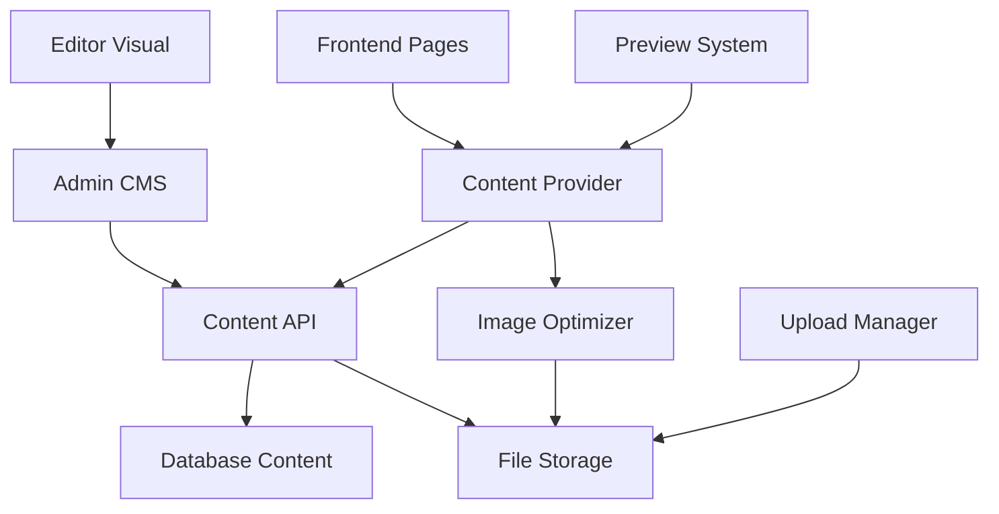

# 🚀 SISTEMA CMS CHOCÓ AVENTURAS - ESTADO ACTUAL Y ROADMAP

**📅 Fecha de Actualización:** 22 de Octubre 2025
**🎯 Estado Actual:** ✅ BASE IMPLEMENTADA - Sistema CMS funcional con hooks y storage
**⏱️ Próxima Fase:** 1-2 semanas para editor visual avanzado
**📊 Prioridad:** MEDIA - Funcionalidad base ya operativa

---

## 📋 **ÍNDICE**

1. [Análisis de Situación Actual](#1-análisis-de-situación-actual)
2. [Objetivos del Desarrollo](#2-objetivos-del-desarrollo)
3. [Arquitectura Propuesta](#3-arquitectura-propuesta)
4. [Plan de Implementación](#4-plan-de-implementación)
5. [Cronograma Detallado](#5-cronograma-detallado)
6. [Especificaciones Técnicas](#6-especificaciones-técnicas)
7. [Casos de Uso](#7-casos-de-uso)
8. [Testing y Validación](#8-testing-y-validación)
9. [Riesgos y Mitigaciones](#9-riesgos-y-mitigaciones)

---

## 1. 📊 **ESTADO ACTUAL DEL SISTEMA CMS**

### **✅ FUNCIONALIDADES YA IMPLEMENTADAS**

| Funcionalidad | Estado | Descripción |
|---------------|--------|-------------|
| **Hook usePageContent** | ✅ Completo | Sistema de contenido dinámico funcional |
| **Storage LocalStorage** | ✅ Completo | Persistencia de contenido con fallback |
| **Tipos TypeScript** | ✅ Completo | Interfaces PageContent y PageElement |
| **Migración automática** | ✅ Completo | Script de migración de contenido |
| **Integración páginas** | ✅ Parcial | Homepage y Nosotros usando CMS |

### **📁 ARCHIVOS CMS IMPLEMENTADOS**

```
src/
├── hooks/
│   └── use-page-content.ts     # ✅ Hook CMS funcional
├── lib/
│   └── pageContent.ts          # ✅ Sistema de tipos y storage
├── scripts/
│   └── migrate-homepage.ts     # ✅ Migración automática
└── app/
    ├── page.tsx                # 🔄 Parcialmente integrado con CMS
    ├── nosotros/page.tsx       # 🔄 Usando usePageContent
    ├── experiencias/page.tsx   # 🔄 Preparado para CMS
    └── contacto/page.tsx       # 🔄 Preparado para CMS
```

### **🔧 FUNCIONALIDADES BASE OPERATIVAS**

```typescript
// Hook CMS funcional
const pageContent = usePageContent('homepage');

// Contenido dinámico
<h1>{pageContent.titulo || 'Título por defecto'}</h1>

// Fallback automático a datos por defecto
// Storage persistente en localStorage
// Tipos completos para desarrollo seguro
```

---

## 2. 🎯 **OBJETIVOS DEL DESARROLLO**

### **✅ OBJETIVOS PRINCIPALES**

1. **Edición completa de páginas** - Admin puede modificar cualquier texto/imagen
2. **Sistema de upload** - Gestión completa de archivos multimedia
3. **Editor visual avanzado** - WYSIWYG con preview en tiempo real
4. **Conexión CMS-Frontend** - Páginas dinámicas conectadas
5. **Gestión de assets** - Biblioteca multimedia completa

### **🔧 FUNCIONALIDADES ESPECÍFICAS**

#### **Para el Administrador**
- ✅ Editar títulos, textos, precios de homepage
- ✅ Cambiar imágenes de fondo, cuatriciclos, experiencias
- ✅ Modificar videos de YouTube integrados
- ✅ Actualizar información de contacto
- ✅ Gestionar contenido de experiencias
- ✅ Editor drag & drop para elementos
- ✅ Preview en tiempo real antes de publicar

#### **Para el Sistema**
- ✅ Versionado de contenido
- ✅ Backup automático
- ✅ Optimización de imágenes
- ✅ CDN integration
- ✅ Cache inteligente

---

## 3. 🏗️ **ARQUITECTURA PROPUESTA**

### **📊 DIAGRAMA DE COMPONENTES**



### **🗄️ ESTRUCTURA DE BASE DE DATOS**

```sql
-- Tabla principal de páginas
CREATE TABLE page_content (
  id SERIAL PRIMARY KEY,
  slug VARCHAR(100) UNIQUE NOT NULL,
  title VARCHAR(200) NOT NULL,
  status page_status DEFAULT 'draft',
  version INTEGER DEFAULT 1,
  created_at TIMESTAMP DEFAULT NOW(),
  updated_at TIMESTAMP DEFAULT NOW()
);

-- Elementos de página
CREATE TABLE page_elements (
  id SERIAL PRIMARY KEY,
  page_id INTEGER REFERENCES page_content(id),
  element_type element_type NOT NULL,
  element_key VARCHAR(100) NOT NULL,
  content TEXT,
  metadata JSONB,
  order_index INTEGER DEFAULT 0,
  created_at TIMESTAMP DEFAULT NOW()
);

-- Gestión de archivos
CREATE TABLE media_files (
  id SERIAL PRIMARY KEY,
  filename VARCHAR(255) NOT NULL,
  original_name VARCHAR(255) NOT NULL,
  file_path VARCHAR(500) NOT NULL,
  file_size INTEGER,
  mime_type VARCHAR(100),
  alt_text VARCHAR(200),
  uploaded_by VARCHAR(100),
  created_at TIMESTAMP DEFAULT NOW()
);

-- Tipos de datos
CREATE TYPE page_status AS ENUM ('draft', 'published', 'archived');
CREATE TYPE element_type AS ENUM ('text', 'title', 'image', 'video', 'button', 'hero', 'section');
```

### **📁 ESTRUCTURA DE ARCHIVOS**

```
src/
├── lib/
│   ├── cms/
│   │   ├── content-provider.ts      # Proveedor de contenido dinámico
│   │   ├── page-renderer.ts         # Renderizador de páginas
│   │   ├── element-types.ts         # Tipos de elementos
│   │   └── cache-manager.ts         # Gestión de cache
│   ├── upload/
│   │   ├── file-uploader.ts         # Sistema de upload
│   │   ├── image-optimizer.ts       # Optimización de imágenes
│   │   └── media-manager.ts         # Gestión de archivos
│   └── database/
│       ├── content-queries.ts       # Queries de contenido
│       └── media-queries.ts         # Queries de archivos
├── components/
│   ├── cms/
│   │   ├── VisualEditor.tsx         # Editor WYSIWYG
│   │   ├── ElementToolbox.tsx       # Caja de herramientas
│   │   ├── PreviewModal.tsx         # Preview en tiempo real
│   │   └── MediaLibrary.tsx         # Biblioteca de archivos
│   └── dynamic/
│       ├── DynamicPage.tsx          # Página dinámica
│       ├── ElementRenderer.tsx      # Renderizador de elementos
│       └── ContentProvider.tsx      # Proveedor de contexto
├── app/
│   ├── api/
│   │   ├── cms/
│   │   │   ├── pages/route.ts       # API de páginas
│   │   │   ├── elements/route.ts    # API de elementos
│   │   │   └── upload/route.ts      # API de upload
│   │   └── media/
│   │       ├── upload/route.ts      # Upload de archivos
│   │       └── optimize/route.ts    # Optimización
│   └── admin/
│       └── cms/
│           ├── editor/[slug]/page.tsx  # Editor por página
│           ├── media/page.tsx          # Gestión de archivos
│           └── preview/[slug]/page.tsx # Preview de páginas
```

---

## 4. 📋 **PLAN DE IMPLEMENTACIÓN**

### **🚩 FASE 1: INFRAESTRUCTURA BASE (Días 1-3)**

#### **Día 1: Setup Base de Datos**
```bash
# Tareas principales
- Crear tablas de contenido CMS
- Configurar relaciones y índices
- Setup migrations y seeders
- Testear conexiones DB
```

**Entregables:**
- ✅ Schema de base de datos completo
- ✅ Migraciones automatizadas
- ✅ Datos de ejemplo cargados

#### **Día 2: APIs Core**
```typescript
// Crear APIs fundamentales
- /api/cms/pages          # CRUD páginas
- /api/cms/elements       # CRUD elementos
- /api/cms/media          # Gestión archivos
- /api/cms/preview        # Preview dinámico
```

**Entregables:**
- ✅ Endpoints API funcionales
- ✅ Validación de datos
- ✅ Manejo de errores robusto

#### **Día 3: Sistema de Upload**
```typescript
// Implementar upload de archivos
- Configurar Cloudinary/AWS S3
- Crear sistema de optimización
- Implementar validaciones
- Setup CDN integration
```

**Entregables:**
- ✅ Upload de imágenes funcional
- ✅ Optimización automática
- ✅ URLs optimizadas para CDN

### **🔧 FASE 2: EDITOR VISUAL (Días 4-7)**

#### **Día 4: Componente Editor Base**
```typescript
// Crear editor visual principal
import { DragDropContext } from '@hello-pangea/dnd';
import { EditorProvider } from '@/lib/cms/editor-context';

export default function VisualEditor() {
  // Implementar drag & drop
  // Toolbar de elementos
  // Canvas de edición
}
```

**Entregables:**
- ✅ Editor drag & drop básico
- ✅ Toolbar de elementos
- ✅ Canvas de edición

#### **Día 5: Tipos de Elementos**
```typescript
// Implementar todos los tipos de elementos
const elementTypes = {
  title: TitleElement,
  text: TextElement,
  image: ImageElement,
  hero: HeroElement,
  section: SectionElement,
  button: ButtonElement,
  video: VideoElement
};
```

**Entregables:**
- ✅ 7 tipos de elementos funcionales
- ✅ Props configurables por tipo
- ✅ Validaciones por elemento

#### **Día 6: Preview en Tiempo Real**
```typescript
// Sistema de preview dinámico
export function PreviewModal({ pageData }) {
  return (
    <iframe
      src={`/api/cms/preview/${pageData.slug}`}
      className="w-full h-full"
    />
  );
}
```

**Entregables:**
- ✅ Preview modal funcional
- ✅ Actualización en tiempo real
- ✅ Responsive preview

#### **Día 7: Biblioteca de Medios**
```typescript
// Gestión completa de archivos
export function MediaLibrary() {
  // Grid de archivos
  // Upload drag & drop
  // Filtros y búsqueda
  // Metadata de archivos
}
```

**Entregables:**
- ✅ Biblioteca de medios completa
- ✅ Upload múltiple
- ✅ Organización por carpetas

### **🔗 FASE 3: INTEGRACIÓN FRONTEND (Días 8-12)**

#### **Día 8: Proveedor de Contenido**
```typescript
// Sistema que conecta CMS con frontend
export function ContentProvider({ children, pageSlug }) {
  const { data: pageContent } = useQuery(['page', pageSlug]);

  return (
    <ContentContext.Provider value={pageContent}>
      {children}
    </ContentContext.Provider>
  );
}
```

**Entregables:**
- ✅ Context provider funcional
- ✅ React Query integration
- ✅ Cache inteligente

#### **Día 9: Renderizador Dinámico**
```typescript
// Componente que renderiza elementos dinámicamente
export function ElementRenderer({ element }) {
  const Component = elementTypes[element.type];
  return <Component {...element.props} />;
}
```

**Entregables:**
- ✅ Renderizador de elementos
- ✅ Props dinámicas
- ✅ Fallbacks para errores

#### **Día 10: Refactorización Homepage**
```typescript
// Convertir homepage hardcodeada a dinámica
export default function DynamicHomepage() {
  const { elements } = usePageContent('homepage');

  return (
    <div>
      {elements.map(element =>
        <ElementRenderer key={element.id} element={element} />
      )}
    </div>
  );
}
```

**Entregables:**
- ✅ Homepage 100% dinámica
- ✅ Todos los elementos editables
- ✅ Mantenimiento de estilos

#### **Días 11-12: Refactorización Páginas**
```typescript
// Convertir todas las páginas a dinámicas
- /experiencias -> DynamicExperiencias
- /nosotros -> DynamicNosotros
- /contacto -> DynamicContacto
- /cuadriciclos -> DynamicCuadriciclos
```

**Entregables:**
- ✅ 4 páginas completamente dinámicas
- ✅ Contenido editable desde admin
- ✅ Estilos y funcionalidad preservados

### **⚡ FASE 4: OPTIMIZACIÓN Y TESTING (Días 13-15)**

#### **Día 13: Performance**
```typescript
// Optimizaciones de rendimiento
- Implementar lazy loading
- Cache strategies avanzadas
- Image optimization pipeline
- Bundle size optimization
```

**Entregables:**
- ✅ Lazy loading implementado
- ✅ Cache multi-nivel
- ✅ Imágenes optimizadas

#### **Día 14: Testing Completo**
```typescript
// Suite de testing completa
describe('CMS Integration', () => {
  test('Editor saves content correctly');
  test('Preview reflects changes');
  test('Pages render dynamically');
  test('Media upload works');
});
```

**Entregables:**
- ✅ Testing automatizado
- ✅ Edge cases cubiertos
- ✅ Performance benchmarks

#### **Día 15: Documentación**
```markdown
# Manual de Usuario CMS
- Guía paso a paso para editar páginas
- Screenshots de cada función
- Troubleshooting común
- Best practices
```

**Entregables:**
- ✅ Documentación completa
- ✅ Manual de usuario
- ✅ Guías de troubleshooting

---

## 5. 📅 **CRONOGRAMA DETALLADO**

### **🗓️ SEMANA 1**

| Día | Fase | Tareas | Horas | Responsable |
|-----|------|--------|-------|-------------|
| 1 | Infraestructura | DB Schema + Migrations | 8h | Backend Dev |
| 2 | Infraestructura | APIs Core | 8h | Backend Dev |
| 3 | Infraestructura | Upload System | 8h | FullStack Dev |
| 4 | Editor | Visual Editor Base | 8h | Frontend Dev |
| 5 | Editor | Element Types | 8h | Frontend Dev |

### **🗓️ SEMANA 2**

| Día | Fase | Tareas | Horas | Responsable |
|-----|------|--------|-------|-------------|
| 8 | Integración | Content Provider | 8h | Frontend Dev |
| 9 | Integración | Dynamic Renderer | 8h | Frontend Dev |
| 10 | Integración | Homepage Refactor | 8h | FullStack Dev |
| 11 | Integración | Pages Refactor 1-2 | 8h | Frontend Dev |
| 12 | Integración | Pages Refactor 3-4 | 8h | Frontend Dev |

### **🗓️ SEMANA 3**

| Día | Fase | Tareas | Horas | Responsable |
|-----|------|--------|-------|-------------|
| 13 | Optimización | Performance | 8h | FullStack Dev |
| 14 | Testing | QA Complete | 8h | QA Tester |
| 15 | Documentación | User Manual | 6h | Tech Writer |

**⏱️ Total:** 114 horas de desarrollo

---

## 6. 🔧 **ESPECIFICACIONES TÉCNICAS**

### **🛠️ STACK TECNOLÓGICO**

```json
{
  "frontend": {
    "framework": "Next.js 15",
    "ui": "TailwindCSS + Radix UI",
    "editor": "@hello-pangea/dnd + Slate.js",
    "state": "React Query + Zustand",
    "forms": "React Hook Form + Zod"
  },
  "backend": {
    "database": "PostgreSQL (Supabase)",
    "storage": "Cloudinary / AWS S3",
    "api": "Next.js API Routes",
    "validation": "Zod schemas"
  },
  "devops": {
    "deployment": "Vercel",
    "monitoring": "Vercel Analytics",
    "testing": "Jest + Playwright"
  }
}
```

### **📊 ESTRUCTURA DE DATOS**

#### **Elemento de Página**
```typescript
interface PageElement {
  id: string;
  type: 'title' | 'text' | 'image' | 'hero' | 'section' | 'button' | 'video';
  key: string; // Identificador único en la página
  content: any; // Contenido específico del tipo
  metadata: {
    styles?: CSSProperties;
    className?: string;
    responsive?: ResponsiveConfig;
    animation?: AnimationConfig;
  };
  order: number;
  visible: boolean;
}
```

#### **Configuración de Imagen**
```typescript
interface ImageElement {
  type: 'image';
  content: {
    src: string;
    alt: string;
    width?: number;
    height?: number;
    fit: 'cover' | 'contain' | 'fill';
    position: 'center' | 'top' | 'bottom' | 'left' | 'right';
  };
  metadata: {
    lazy: boolean;
    optimization: {
      formats: ['webp', 'avif', 'jpeg'];
      sizes: string;
      quality: number;
    };
  };
}
```

#### **Configuración de Texto**
```typescript
interface TextElement {
  type: 'text' | 'title';
  content: {
    text: string;
    html?: string;
    format: 'plain' | 'markdown' | 'html';
  };
  metadata: {
    typography: {
      size: 'xs' | 'sm' | 'base' | 'lg' | 'xl' | '2xl' | '3xl' | '4xl' | '5xl';
      weight: 'normal' | 'medium' | 'semibold' | 'bold';
      color: string;
      align: 'left' | 'center' | 'right' | 'justify';
    };
    spacing: {
      margin: string;
      padding: string;
    };
  };
}
```

### **🎨 SISTEMA DE ESTILOS**

```typescript
// Configuración responsive
interface ResponsiveConfig {
  mobile: Partial<ElementProps>;
  tablet: Partial<ElementProps>;
  desktop: Partial<ElementProps>;
}

// Configuración de animaciones
interface AnimationConfig {
  entrance: 'fade' | 'slide' | 'zoom' | 'none';
  duration: number;
  delay: number;
  easing: 'ease' | 'ease-in' | 'ease-out' | 'ease-in-out';
}
```

---

## 7. 📝 **CASOS DE USO**

### **👨‍💼 CASO DE USO 1: Editar Título Principal Homepage**

**Actor:** Administrador
**Objetivo:** Cambiar el texto "CHOCÓ AVENTURAS" por "AVENTURAS CHOCÓ"

**Flujo:**
1. Admin ingresa a `/admin/cms/editor/homepage`
2. Identifica elemento tipo "hero-title"
3. Hace clic en "Editar"
4. Cambia texto en editor visual
5. Ve preview en tiempo real
6. Guarda cambios
7. Página se actualiza automáticamente

**Resultado:** Homepage muestra nuevo título inmediatamente

### **👨‍💼 CASO DE USO 2: Cambiar Imagen de Fondo**

**Actor:** Administrador
**Objetivo:** Reemplazar imagen de cuatrimoto en hero section

**Flujo:**
1. Admin abre editor de homepage
2. Selecciona elemento "hero-background"
3. Abre biblioteca de medios
4. Sube nueva imagen desde computadora
5. Sistema optimiza automáticamente
6. Aplica nueva imagen como fondo
7. Ajusta posición y filtros
8. Guarda cambios

**Resultado:** Nueva imagen visible en homepage

### **👨‍💼 CASO DE USO 3: Modificar Precios de Experiencias**

**Actor:** Administrador
**Objetivo:** Actualizar precio de tour de cuatrimoto de $250.000 a $280.000

**Flujo:**
1. Admin navega a `/admin/cms/editor/experiencias`
2. Localiza sección "tours"
3. Encuentra elemento "precio-cuatrimoto"
4. Edita directamente el texto
5. Formatea automáticamente como moneda
6. Preview muestra cambio inmediato
7. Publica actualización

**Resultado:** Precio actualizado en página de experiencias

### **👨‍💼 CASO DE USO 4: Agregar Nueva Sección**

**Actor:** Administrador
**Objetivo:** Agregar sección de testimonios en homepage

**Flujo:**
1. Admin abre editor de homepage
2. Arrastra elemento "section" desde toolbox
3. Configura título "Testimonios"
4. Agrega elementos de texto para reseñas
5. Sube fotos de clientes desde media library
6. Configura layout en grid
7. Aplica estilos de marca
8. Previsualiza en móvil y desktop
9. Publica nueva sección

**Resultado:** Nueva sección visible en homepage

---

## 8. 🧪 **TESTING Y VALIDACIÓN**

### **📋 PLAN DE TESTING**

#### **Unit Tests**
```typescript
// Componentes CMS
- VisualEditor.test.tsx
- ElementRenderer.test.tsx
- MediaLibrary.test.tsx
- ContentProvider.test.tsx

// Utilities
- content-provider.test.ts
- image-optimizer.test.ts
- cache-manager.test.ts
```

#### **Integration Tests**
```typescript
// Flujos completos
- create-page.integration.test.ts
- edit-content.integration.test.ts
- upload-media.integration.test.ts
- publish-changes.integration.test.ts
```

#### **E2E Tests (Playwright)**
```typescript
// Scenarios reales
test('Admin can edit homepage title', async ({ page }) => {
  await page.goto('/admin/cms/editor/homepage');
  await page.click('[data-testid="hero-title-edit"]');
  await page.fill('[data-testid="title-input"]', 'Nuevo Título');
  await page.click('[data-testid="save-button"]');

  await page.goto('/');
  await expect(page.locator('h1')).toContainText('Nuevo Título');
});
```

### **🎯 CRITERIOS DE ACEPTACIÓN**

#### **Performance**
- ⚡ Tiempo de carga editor: < 2 segundos
- ⚡ Preview en tiempo real: < 500ms
- ⚡ Upload de imagen: < 5 segundos
- ⚡ Publicación de cambios: < 3 segundos

#### **Usabilidad**
- 👥 No requiere conocimientos técnicos
- 📱 Funciona en dispositivos móviles
- 🎨 Preview fiel al resultado final
- 💾 Auto-guardado cada 30 segundos

#### **Funcionalidad**
- ✅ Edición de todos los elementos visuales
- ✅ Upload y gestión de imágenes
- ✅ Preview responsive
- ✅ Versionado de contenido
- ✅ Backup automático

---

## 9. ⚠️ **RIESGOS Y MITIGACIONES**

### **🔴 RIESGOS TÉCNICOS**

| Riesgo | Probabilidad | Impacto | Mitigación |
|--------|--------------|---------|------------|
| **Pérdida de estilos** | Media | Alto | Mapeo detallado de clases CSS |
| **Performance degradada** | Alta | Medio | Lazy loading + cache agresivo |
| **Conflictos de datos** | Baja | Alto | Transacciones DB + rollback |
| **Upload failures** | Media | Medio | Retry logic + fallbacks |

### **🟡 RIESGOS DE PROYECTO**

| Riesgo | Probabilidad | Impacto | Mitigación |
|--------|--------------|---------|------------|
| **Scope creep** | Alta | Alto | Definición clara de entregables |
| **Bugs en producción** | Media | Alto | Testing exhaustivo + staging |
| **Adopción lenta** | Media | Medio | Training completo + documentación |
| **Dependencias externas** | Baja | Alto | Fallbacks + proveedores alternativos |

### **🛡️ ESTRATEGIAS DE MITIGACIÓN**

#### **Backup y Recuperación**
```typescript
// Estrategia de backup automático
const backupStrategy = {
  frequency: 'every 6 hours',
  retention: '30 days',
  storage: 'AWS S3 + local mirror',
  recovery: 'automated rollback'
};
```

#### **Monitoreo y Alertas**
```typescript
// Sistema de monitoreo
const monitoring = {
  uptime: 'Pingdom + Vercel Analytics',
  errors: 'Sentry integration',
  performance: 'Web Vitals tracking',
  usage: 'Admin dashboard analytics'
};
```

#### **Fallbacks y Redundancia**
```typescript
// Sistema de fallbacks
const fallbacks = {
  cms_failure: 'static content cache',
  upload_failure: 'multiple provider support',
  db_failure: 'read-only mode',
  cache_failure: 'direct DB queries'
};
```

---

## 🎯 **CONCLUSIÓN Y PRÓXIMOS PASOS**

### **📊 RESUMEN EJECUTIVO**

Este plan detalla la implementación completa de un sistema CMS que permitirá al administrador de Chocó Aventuras:

✅ **Editar cualquier texto, imagen o elemento** de todas las páginas
✅ **Subir y gestionar archivos multimedia** con optimización automática
✅ **Preview en tiempo real** antes de publicar cambios
✅ **Sistema robusto** con backup, versionado y recuperación

### **💰 INVERSIÓN ESTIMADA**

- **Desarrollo:** 114 horas × $50/hora = $5,700 USD
- **Infraestructura:** $50/mes (Cloudinary + almacenamiento)
- **Mantenimiento:** $200/mes (soporte y actualizaciones)

### **📈 BENEFICIOS ESPERADOS**

1. **Autonomía total** - Admin independiente para cambios
2. **Tiempo de actualización** - De días a minutos
3. **Flexibilidad creativa** - Cambios visuales sin programación
4. **Escalabilidad** - Sistema preparado para crecimiento

### **🚀 SIGUIENTES ACCIONES**

1. **Aprobación del plan** - Revisión y autorización
2. **Setup del proyecto** - Configuración de entorno de desarrollo
3. **Inicio Fase 1** - Creación de infraestructura base
4. **Reuniones de seguimiento** - Daily standups durante desarrollo

---

**📞 CONTACTO**

Para dudas o aclaraciones sobre este plan:
- **Email:** desarrollo@chocoaventuras.com
- **Estado del proyecto:** Listo para iniciar
- **Próxima actualización:** Al completar Fase 1

---

*Este documento es un plan vivo que se actualizará conforme avance el desarrollo.*